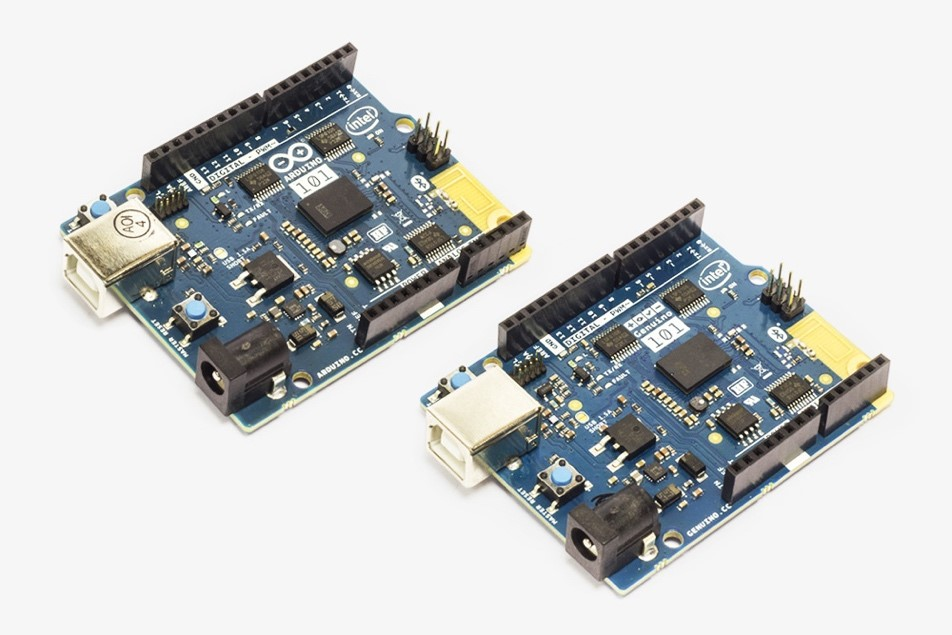

# Arduino / Genuino 101

## A hands on tutorial

## Arduino / Genuino 101 Tutorials: Design of experiments

## Tutorial 1: LED Control Over Bluetooth

### Learning Objectives:

_After performing this lab exercise, you will be able to:_

* Create Arduino sketch \(code\) and program Arduino/Genuino 101 board
* Understand the working of Bluetooth Low Energy protocol
* Create a BLE service using Genuino 101 board
* Connect to Genuino 101 board service from PC/mobile BLE app
* Control the LED on/off using PC/mobile app

### Tools and Components Required:

_To perform this lab experiment, you will need:_

#### [http://www.pakronics.com.au/collections/genuino-arduino-cc/products/genuino-101-pakr-m0012](http://www.pakronics.com.au/collections/genuino-arduino-cc/products/genuino-101-pakr-m0012) 

#### [http://www.pakronics.com.au/products/9v-battery-clip-with-5-5mm-2-1mm-plug-ada80](http://www.pakronics.com.au/products/9v-battery-clip-with-5-5mm-2-1mm-plug-ada80) \|

### Working principle of key components

_Before performing this lab experiment, it is important to learn following concepts:_

* Arduino/Genuino 101 is a low-power consumption and high-performance version of Arduino board with Bluetooth low-energy \(BLE\) and 6-axis accelerometer on board. It is compatible with Arduino/Genuino Uno in term of form factor and peripheral list. \(For more details, please visit: [https://www.arduino.cc/en/Main/ArduinoBoard101](https://www.arduino.cc/en/Main/ArduinoBoard101)\).
* Arduino/Genuino 101 can be easily programmed using Arduino IDE \(version 1.6.7 and higher\). However, the hardware libraries for Arduino/Genuino 101 board needs to be updated / installed. \(Refer appendix for detailed procedure\).
* CurieBLE library is used for programming the on-board BLE of Arduino/Genuino 101. Bluetooth 4.0 supports both traditional Bluetooth and the new Bluetooth Low Energy \(or BLE\). BLE is optimized for lower power consumption at lower data rates. \(further details: [https://www.arduino.cc/en/Main/ArduinoBoard101](https://www.arduino.cc/en/Main/ArduinoBoard101)\).
* A BLE device can act as peripheral device \(or bulletin board\) or central device \(reader\). A bulletin would post data in the form of characteristics of different services. These characteristics from bulletin \(or peripheral BLE device\) can be read or written by reader \(central BLE devices\).

* The information presented by the peripheral or bulletin is structured as services. Each service is further divided into characteristics. These characteristics are the actual data that is exchanged between peripheral and central devices.
* As demonstrated in this tutorial, a service can be created with a characteristic for controlling the on-board LED at pin 13. A central device \(a mobile or PC app\) would then be able to read the status of LED and control it \(turn it on/off\).
* One can use a standard service or define an own custom service. A standard service has 16 bit \(or 4 hex characters\) Universally Unique Identifier \(UUID\) whereas a custom UUID has 128 bits \( = 32 hex characters\).
* A service can have multiple characteristics. A characteristics value can be up to 20 bytes long.
* A BLE device can be recognized by others using their General Advertising Profile \(GAP\) which contains a customizable ‘device name’ and list of services it provides.

### Key commands

_Before programming the Arduino/Genuino 101, it is important to learn following key commands:_

* blePeripheral.setDeviceName

  Sets the BLE device name as descriptor for other devices to identifiy

* blePeripheral.setAdvertisedServiceUuid

  Set the UUID of the service to be provided

* blePeripheral.addAttribute

  Add services or characteristics to the BLE peripheral

* blePeripheral.setEventHandler

  Assign callback functions for different BLE peripheral events

* characteristics.setValue

  Sets the value of the ‘characteristics’

* characteristics.Value

  Gets the value of the ‘characteristics’

* blePeripheral.poll

  Polls \(looks for\) any even related to BLE peripheral

### Check Your Understanding

1. A BLE device can be configured as:
   1. Reader or central device
   2. Bulletin or peripheral device
   3. Both a & b
   4. None of a & b
2. A standard service has UUID of length \__\_\_
   1. 16 bytes
   2. 16 bits
   3. 128 bytes
   4. 128 bits
3. A custom service has UUID of length \__\_\_
   1. 16 bytes
   2. 16 bits
   3. 128 bytes
   4. 128 bits
4. UUID stands for
   1. Undoubtedly Unique Identifier
   2. Universally Unique Identifier
   3. User-defined Unique Identifier
   4. Unique User Identifier
5. What is NOT part of Genuino 101 board?
   1. Accelerometer
   2. Character LCD
   3. PWM pins
   4. Bluetooth
6. GAP stands for \__\_\_
   1. General Advertising Profile
   2. Genuino Arduino Profile
   3. Genuino Access Protocol
   4. Genuino As Peripheral
7. A characteristic value can have a maximum length of \__\_
   1. 8 bytes
   2. 16 bytes
   3. 20 bytes
   4. 4 bytes

### Procedure

#### Hardware Setup

1. Connect the Arduino/Genuino 101 board with computer using USB cable.

#### Arduino IDE / Library Setup

1. Make sure you have Arduino IDE version 1.6.7 or higher and Intel Genuino 101

   drivers installed on your computer. For installation of Arduino IDE and

   drivers, you can follow instructions from \[Appendix

   A\]\(\#a-how-to-install-curie-libraries\).

#### Creating Sketch / Program

1. Open the sketch \(G101\_Ex-1\_BLE\_LED\_control.ino\) on Arduino IDE.

   

2. From Tools menu, select the right board \(i.e., Arduino/Genuino 101\) and COM Port it is connected to.

   

3. Compile \(verify\) and run \(upload\) the sketch on Arduino board. In case of any upload error, try pressing the Master Reset Button just at the start of upload process.

   

4. Open the “serial monitor” of Arduino IDE. It will be used to display the messages when BLE central device \(reader – app on mobile or PC\) gets connected to, disconnected from Genuino 101 board or the LED is turned on/off using the app.

#### BLE App \(PC / Mobile\) Setup

1. BLE is supported only on Bluetooth 4.0 hardware. Ensure your computer / mobile / tablet hardware supports BLE. You’ll need appropriate BLE app to communicate with Genuino 101 over Bluetooth. We recommend following free apps: LightBlue for Mac and nRF Master Control for mobile \(Android / iOS\).
2. Open the app and scan for Bluetooth devices. Arduino / Genuino 101 should appear with the name “LED Controller”.

   

3. Click on “LED Controller” under the list of peripherals to connect to it. Once connected, the services and associated characteristics will be populated in respective tabs.

   

4. Clicking on “Read” button will show the value of characteristics \(led\_char\) as “0” and the LED on Arduino / Genuino 101 board will be off.

   

   

5. You can turn on the LED by writing “01” as the characteristics value. Verify that LED on the board is lit up. The value will be updated from 0 1, if you read again.

   

   

   

### Additional Exercise

_You can extend your learning by trying following programming exercises:_

1. Make a system to turn on/off a given digital pin of the Arduino over Bluetooth. One should supply – \(1\) digital pin to be controlled \(2\) on / off state
2. Extend the program 1 to read status of all the digital pins \(pin 2 – 13\) at once. One should also be able to write \(turn on/off\) all of them at once over Bluetooth.

## Tutorial 2: Shock / Tap Detection

### Learning Objectives:

_After performing this lab exercise, you will be able to:_

* Create Arduino sketch \(code\) and program Arduino/Genuino 101 board
* Understand the working of Accelerometers
* Read the acceleration experienced by the Arduino/Genuino 101 board using on-board on-board accelerometers
* Process the accelerometer signals to detect shock or a tap on the board

### Tools and Components Required:

_To perform this lab experiment, you will need:_

#### [http://www.pakronics.com.au/collections/genuino-arduino-cc/products/genuino-101-pakr-m0012](http://www.pakronics.com.au/collections/genuino-arduino-cc/products/genuino-101-pakr-m0012)

#### [http://www.pakronics.com.au/products/9v-battery-clip-with-5-5mm-2-1mm-plug-ada80](http://www.pakronics.com.au/products/9v-battery-clip-with-5-5mm-2-1mm-plug-ada80)

### Working principle of key components

_Before performing this lab experiment, it is important to learn following concepts:_

* Arduino/Genuino 101 is a low-power consumption and high-performance version of Arduino board with Bluetooth low-energy \(BLE\) and accelerometer on board. It is compatible with Arduino/Genuino Uno in term of form factor and peripheral list. \(For more details, please visit: [https://www.arduino.cc/en/Main/ArduinoBoard101](https://www.arduino.cc/en/Main/ArduinoBoard101)\).
* Arduino/Genuino 101 can be easily programmed using Arduino IDE \(version 1.6.7 and higher\). However, the hardware libraries for Arduino/Genuino 101 board needs to be updated / installed. \(Refer appendix for detailed procedure\).
* An accelerometer measures proper acceleration \(g-force\), which is the acceleration it experiences relative to freefall and is the acceleration felt by people and objects. An accelerometer at rest would experience and measure an acceleration of 9.81m/s2 or simply 1g.
* Arduino/Genuino 101 has on-board inertial measurement unit \(IMU\) – BMI 160, developed by Bosch. BMI 160 IMU consists of a low-power 3-axis accelerometer and a 3-axis gyroscope. \( A Details datasheet is available at : [http://ae-bst.resource.bosch.com/media/\_tech/media/datasheets/BST-BMI160-DS000-07.pdf](http://ae-bst.resource.bosch.com/media/_tech/media/datasheets/BST-BMI160-DS000-07.pdf)\).
* CurieIMU library is used for working with the on-board IMU of Arduino/Genuino 101. Using this library, you can access all the parameters, features and reading of IMU chip.
* Tap or shock would cause sudden change in the acceleration values of the board at rest. This ‘differential-acceleration’ values can be compared against a threshold to detect tap or shock.
* Sensitivity of the shock / tap detection can be controlled by varying the threshold.

### Key commands

_Before programming the Arduino/Genuino 101, it is important to learn following key commands:_

* CurieIMU.begin

  Initialize the IMU of the board

* CurieIMU.setAccelerometerRange

  Set the accelerometer range in terms of ‘g’

* CurieIMU.readAccelerometer

  Read the acceleration values \(Ax, Ay and Az\) from on-board IMU

* digitalWrite

  Turn on/off a digital pin of the Arduino / Genuino board

* abs

  Returns the absolute value of the input

### Check Your Understanding

1. IMU stands for:
   1. Input Measurement Unit
   2. Input Microprocessing Unit
   3. Inertial Measurement Unit
   4. Isolation Measurement Unit
2. Arduino / Genuino 101 board IMU features
   1. 3-axis accelerometer
   2. 3-axis gyroscope
   3. both a & b
   4. Neither a nor b
3. An accelerometer of BMI160 chip can measure
   1. Only static acceleration
   2. Only dynamic acceleration
   3. both a & b
   4. Neither a nor b
4. CurieIMU.begin command will
   1. Initialize the IMU
   2. Start reading the acceleration values from IMU
   3. Set the ‘g’ range
   4. Read the gyroscope values
5. What is NOT part of Genuino 101 board?
   1. Accelerometer
   2. Pizzo Buzzer
   3. Bluetooth
   4. Analog pins
6. CurieIMU. setAccelerometerRange command will
   1. Initialize the IMU
   2. Start reading the acceleration values from IMU
   3. Set the ‘g’ range
   4. Read the gyroscope values
7. CurieIMU. readAccelerometer command will
   1. Initialize the IMU
   2. Read the acceleration values from IMU
   3. Set the ‘g’ range
   4. Read the gyroscope values from IMU

### Procedure

#### Hardware Setup

1. Connect the Arduino/Genuino 101 board with computer using USB cable.

   

#### Arduino IDE / Library Setup

1. Make sure you have Arduino IDE version 1.6.7 or higher and Intel Genuino 101

   drivers installed on your computer. For installation of Arduino IDE and

   drivers, you can follow instructions from \[Appendix

   A\]\(\#a-how-to-install-curie-libraries\).

#### Creating Sketch / Program

1. Open the sketch \(G101\_Ex-2\_Shock\_Tap\_Detect.ino\) on Arduino IDE.

   

2. From Tools menu, select the right board \(i.e., Arduino/Genuino 101\) and COM Port it is connected to.

   

3. Compile \(verify\) and run \(upload\) the sketch on Arduino board. In case of any upload error, try pressing the Master Reset Button just at the start of upload process.

   

4. Open the “serial monitor” of Arduino IDE. It will be used to display the accelerometer values.

   

5. Keep the Arduino/Genuino 101 board on a table. When it is at rest, the LED \(on-board LED at pin 13\) will be off. The differential acceleration values \(difference of acceleration now and its previous value\) shown on serial monitor would be around zero.
6. Now gently tap the table or board directly. The LED should glow and you should see the values getting changed to a larger value \(other than zero\) on serial monitor.

   

7. Changes to acceleration values due to tap or shock can be best viewed graphically on a plotter. Close the Serial Monitor and open the Serial plotter. You should see the pulses/spikes when the board is tapped.

   

### Additional Exercise

_You can extend your learning by trying following programming exercises:_

1. Modify the existing program in such a way that upon tapping the board, the plotter also shows the LED being turned on along with the ‘shock’ spikes.
2. Combine the current program with Bluetooth and make a ‘shock’ detector where the board, apart from indicating through LED, also indicate on a mobile through Bluetooth app.

## Tutorial 3: Board Orientation Detection

### Learning Objectives:

_After performing this lab exercise, you will be able to:_

* Create Arduino sketch \(code\) and program Arduino/Genuino 101 board
* Understand the working of Accelerometers
* Read the acceleration experienced by the Arduino/Genuino 101 board using on-board on-board accelerometers
* Process the accelerometer signals to estimate the board orientation

### Tools and Components Required:

_To perform this lab experiment, you will need:_

#### [http://www.pakronics.com.au/collections/genuino-arduino-cc/products/genuino-101-pakr-m0012](http://www.pakronics.com.au/collections/genuino-arduino-cc/products/genuino-101-pakr-m0012) 

#### [http://www.pakronics.com.au/products/9v-battery-clip-with-5-5mm-2-1mm-plug-ada80](http://www.pakronics.com.au/products/9v-battery-clip-with-5-5mm-2-1mm-plug-ada80) \|

### Working principle of key components

_Before performing this lab experiment, it is important to learn following concepts:_

* Arduino/Genuino 101 is a low-power consumption and high-performance version of Arduino board with Bluetooth low-energy \(BLE\) and accelerometer on board. It is compatible with Arduino/Genuino Uno in term of form factor and peripheral list. \(For more details, please visit: [https://www.arduino.cc/en/Main/ArduinoBoard101](https://www.arduino.cc/en/Main/ArduinoBoard101)\).
* Arduino/Genuino 101 can be easily programmed using Arduino IDE \(version 1.6.7 and higher\). However, the hardware libraries for Arduino/Genuino 101 board needs to be updated / installed. \(Refer appendix for detailed procedure\).
* An accelerometer measures proper acceleration \(g-force\), which is the acceleration it experiences relative to freefall and is the acceleration felt by people and objects. An accelerometer at rest would experience and measure an acceleration of 9.81m/s2 or simply 1g.
* Arduino/Genuino 101 has on-board inertial measurement unit \(IMU\) – BMI 160, developed by Bosch. BMI 160 IMU consists of a low-power 3-axis accelerometer and a 3-axis gyroscope. \( A Details datasheet is available at : [http://ae-bst.resource.bosch.com/media/\_tech/media/datasheets/BST-BMI160-DS000-07.pdf](http://ae-bst.resource.bosch.com/media/_tech/media/datasheets/BST-BMI160-DS000-07.pdf)\).
* CurieIMU library is used for working with the on-board IMU of Arduino/Genuino 101. Using this library, you can access all the parameters, features and reading of IMU chip.
* Based on the orientation of the board, the acceleration value for 3-axis would change. At rest, the axis facing opposite to gravity will indicate acceleration of 1g \(16K ADC levels\). The axis facing downwards \(aligned with gravity\) will indicate -1g \(negative sign indicates pull towards earth’s gravity\).
* The axes perpendicular to earth’s gravity will indicate 0g.
* Thus when board is held with USB connector facing downwards, x-axis would indicate acceleration value of +1g.

* The orientation detection mechanism is used in smartphones to stop the

  caller tone / snooze alarm when the phone is flipped.

### Key commands

_Before programming the Arduino/Genuino 101, it is important to learn following key commands:_

* CurieIMU.begin

  Initialize the IMU of the board

* CurieIMU.setAccelerometerRange

  Set the accelerometer range in terms of ‘g’

* CurieIMU.readAccelerometer

  Read the acceleration values \(Ax, Ay and Az\) from on-board IMU

* digitalWrite

  Turn on/off a digital pin of the Arduino / Genuino board

* abs

  Returns the absolute value of the input

### Check Your Understanding

1. IMU stands for:
   1. Input Measurement Unit
   2. Input Microprocessing Unit
   3. Inertial Measurement Unit
   4. Isolation Measurement Unit
2. Arduino/Genuino 101 board is kept on a table. The axis facing upwards would indicate:
   1. +1g
   2. -1g
   3. +2g
   4. -2g
3. Arduino/Genuino 101 board is kept on a table with ‘digital pin edge’ facing upwards. Which axis will show +1g acceleration?
   1. X-axis
   2. Y-Axis
   3. Z-axis
   4. No axis will show +1g, one of them would indicate -1g.
4. CurieIMU.begin command will
   1. Initialize the IMU
   2. Start reading the acceleration values from IMU
   3. Set the ‘g’ range
   4. Read the gyroscope values
5. What is NOT part of Genuino 101 board?
   1. Accelerometer
   2. Pizzo Buzzer
   3. Bluetooth
   4. Analog pins
6. CurieIMU. setAccelerometerRange command will
   1. Initialize the IMU
   2. Start reading the acceleration values from IMU
   3. Set the ‘g’ range
   4. Read the gyroscope values
7. CurieIMU. readAccelerometer command will
   1. Initialize the IMU
   2. Read the acceleration values from IMU
   3. Set the ‘g’ range
   4. Read the gyroscope values from IMU

### Procedure

#### Hardware Setup

1. Connect the Arduino/Genuino 101 board with computer using USB cable.

   

#### Arduino IDE / Library Setup

1. Make sure you have Arduino IDE version 1.6.7 or higher and Intel Genuino 101

   drivers installed on your computer. For installation of Arduino IDE and

   drivers, you can follow instructions from \[Appendix

   A\]\(\#a-how-to-install-curie-libraries\).

#### Creating Sketch / Program

1. Open the sketch \(G101\_Ex-3\_Board\_Orientation\_Detection.ino\) on Arduino IDE.

   

2. From Tools menu, select the right board \(i.e., Arduino/Genuino 101\) and COM Port it is connected to.

   

3. Compile \(verify\) and run \(upload\) the sketch on Arduino board. In case of any upload error, try pressing the Master Reset Button just at the start of upload process.

   

4. Open the “serial monitor” of Arduino IDE. It will be used to display the accelerometer values and board orientation.

   

5. Keep the Arduino/Genuino 101 board on a table. When it is at rest, the LED \(on-board LED at pin 13\) will be off. Initially nothing would come up on the Serial monitor.
6. Now change the orientation of the board – flip it or put analog pin side up etc. The LED should blink as and when you change the orientation of the board. The orientation of the board and acceleration values for 3-axis corresponding to that orientation would be displayed on serial monitor.

   

7. Verify the value of the accelerometers and orientation reported by the program against actual orientation of the board.

   

### Additional Exercise

_You can extend your learning by trying following programming exercises:_

1. Make a system where the LED on board blinks every 20s, simulating a caller ring. The blink should be turned off when the board is flipped upside down \(components facing down\).
2. Combine the current program with Bluetooth and make an orientation detector where the board orientation is indicated on a mobile through Bluetooth app.

## Tutorial 4: Pedometer – Step Counting Over Bluetooth

### Learning Objectives:

_After performing this lab exercise, you will be able to:_

* Create Arduino sketch \(code\) and program Arduino/Genuino 101 board
* Understand the working of Bluetooth Low Energy protocol
* Work with on-board accelerometers \(Inertial Measurement Units\) to calculate step count
* Create a BLE service and transmit step count using Genuino 101 board
* Connect to Genuino 101 board service from PC/mobile BLE app and receive step count over Bluetooth

### Tools and Components Required:

_To perform this lab experiment, you will need:_

#### [http://www.pakronics.com.au/collections/genuino-arduino-cc/products/genuino-101-pakr-m0012](http://www.pakronics.com.au/collections/genuino-arduino-cc/products/genuino-101-pakr-m0012) 

[http://www.pakronics.com.au/products/9v-battery-clip-with-5-5mm-2-1mm-plug-ada80](http://www.pakronics.com.au/products/9v-battery-clip-with-5-5mm-2-1mm-plug-ada80)

### Working principle of key components

_Before performing this lab experiment, it is important to learn following concepts:_

* Arduino/Genuino 101 is a low-power consumption and high-performance version of Arduino board with Bluetooth low-energy \(BLE\) and 6-axis accelerometer on board. It is compatible with Arduino/Genuino Uno in term of form factor and peripheral list. \(For more details, please visit: [https://www.arduino.cc/en/Main/ArduinoBoard101](https://www.arduino.cc/en/Main/ArduinoBoard101)\).
* Arduino/Genuino 101 can be easily programmed using Arduino IDE \(version 1.6.7 and higher\). However, the hardware libraries for Arduino/Genuino 101 board needs to be updated / installed. \(Refer appendix for detailed procedure\).
* CurieBLE library is used for programming the on-board BLE of Arduino/Genuino 101. Bluetooth 4.0 supports both traditional Bluetooth and the new Bluetooth Low Energy \(or BLE\). BLE is optimized for lower power consumption at lower data rates. \(further details: [https://www.arduino.cc/en/Main/ArduinoBoard101](https://www.arduino.cc/en/Main/ArduinoBoard101)\).
* A BLE device can act as peripheral device \(or bulletin board\) or central device \(reader\). A bulletin would post data in the form of characteristics of different services. These characteristics from bulletin \(or peripheral BLE device\) can be read or written by reader \(central BLE devices\).

* The information presented by the peripheral or bulletin is structured as services. Each service is further divided into characteristics. These characteristics are the actual data that is exchanged between peripheral and central devices.
* One can use a standard service or define an own custom service. A standard service has 16 bit \(or 4 hex characters\) Universally Unique Identifier \(UUID\) whereas a custom UUID has 128 bits \( = 32 hex characters\). A service can have multiple characteristics. A characteristics value can be up to 20 bytes long.
* An accelerometer measures proper acceleration \(g-force\), which is the acceleration it experiences relative to freefall and is the acceleration felt by people and objects. An accelerometer can sense both statics \(acceleration at rest\) and dynamic \(acceleration due to motion\) acceleration.
* Arduino/Genuino 101 has on-board inertial measurement unit \(IMU\) – BMI 160, developed by Bosch. BMI 160 IMU consists of a low-power 3-axis accelerometer and a 3-axis gyroscope. \(A Details datasheet is available at : [http://ae-bst.resource.bosch.com/media/\_tech/media/datasheets/BST-BMI160-DS000-07.pdf](http://ae-bst.resource.bosch.com/media/_tech/media/datasheets/BST-BMI160-DS000-07.pdf)\).
* CurieIMU library is used for working with the on-board IMU of Arduino/Genuino 101. This library also provides the function for counting steps by analyzing the accelerometer signals.
* As demonstrated in this tutorial, a service can be created with a characteristic for notification of step count. A central device \(a mobile or PC app\) would need to subscribe to the service/characteristics thus enabling it to receive the updated step count as soon as it changes.

### Key commands

_Before programming the Arduino/Genuino 101, it is important to learn following key commands:_

* blePeripheral.setDeviceName

  Sets the BLE device name as descriptor for other devices to identify

* blePeripheral.setAdvertisedServiceUuid

  Set the UUID of the service to be provided

* blePeripheral.addAttribute

  Add services or characteristics to the BLE peripheral

* blePeripheral.setEventHandler

  Assign callback functions for different BLE peripheral events

* characteristics.setValue

  Sets the value of the ‘characteristics’

* characteristics.Value

  Gets the value of the ‘characteristics’

* blePeripheral.poll

  Polls \(looks for\) any even related to BLE peripheral

* CurieIMU.begin

  Initialize the IMU of the board

* CurieIMU.setStepCountEnabled

  Enable the step counting

* CurieIMU.setStepDetectionMode

  Turn on the step detection mode

* CurieIMU.getStepCount

  Reads the step count

### Check Your Understanding

1. A BLE device can be configured as:
   1. Reader or central device
   2. Bulletin or peripheral device
   3. Both a & b
   4. None of a & b
2. A standard service has UUID of length \__\_\_
   1. 16 bytes
   2. 16 bits
   3. 128 bytes
   4. 128 bits
3. Which of the following command would read the value of the characteristics?
   1. characteristics.setValue
   2. characteristics.Value
   3. characteristics.readValue
   4. characteristics.returnValue
4. UUID stands for
   1. Undoubtedly Unique Identifier
   2. User-defined Unique Identifier
   3. Universally Unique Identifier
   4. Unique User Identifier
5. CurieIMU.setStepCountEnabled command will
6. Initialize the IMU
7. Enable the step counting
8. Set the callback function upon step detection
9. Turn on the step detection mode
10. CurieIMU.setStepDetectionMode command will
11. Initialize the IMU
12. Enable the step counting
13. Set the callback function upon step detection
14. Turn on the step detection mode
15. A characteristic value can have a maximum length of \__\_
    1. 8 bytes
    2. 16 bytes
    3. 20 bytes
    4. 4 bytes

### Procedure

#### Hardware Setup

1. Connect the Arduino/Genuino 101 board with computer using USB cable.

   

#### Arduino IDE / Library Setup

1. Make sure you have Arduino IDE version 1.6.7 or higher and Intel Genuino 101

   drivers installed on your computer. For installation of Arduino IDE and

   drivers, you can follow instructions from \[Appendix

   A\]\(\#a-how-to-install-curie-libraries\).

#### Creating Sketch / Program

1. Open the sketch \(G101\_Ex-4\_Bluetooth\_Pedometer.ino\) on Arduino IDE.

   

2. From Tools menu, select the right board \(i.e., Arduino/Genuino 101\) and COM Port it is connected to.

   

3. Compile \(verify\) and run \(upload\) the sketch on Arduino board. In case of any upload error, try pressing the Master Reset Button just at the start of upload process.

   

#### BLE App \(PC / Mobile\) Setup

1. BLE is supported only on Bluetooth 4.0 hardware. Ensure your computer / mobile / tablet hardware supports BLE. You’ll need appropriate BLE app to communicate with Genuino 101 over Bluetooth. We recommend following free apps: LightBlue for Mac and nRF Master Control for mobile \(Android / iOS\).
2. Open the app and scan for Bluetooth devices. Arduino / Genuino 101 should appear with the name “StepCounter”.

   

3. Click on “StepCounter” under the list of peripherals to connect to it. Successful connection will be indicated in two ways – \(i\) on-board LED at pin 13 would glow, \(ii\) the services offered by the device would show up in ‘services’ column. Selecting a service will show associated characteristics in respective tabs.

   

4. Clicking on “Subscribe” button will register the app for receiving the notifications of change in this characteristics \(step count\) value.
5. After subscribing, shake the Arduino/Genuino 101 board as if you are walking holding in your hand. You should see the count value changing on the app.

   

6. You can try powering the board, after uploading of the sketch, using a battery pack and hold it while you walk around. You can see the electronic, wireless pedometer in action.

### Additional Exercise

_You can extend your learning by trying following programming exercises:_

1. Convert the existing step counting mechanism to detect any other form of exercise \(say squatting / sit-ups\) by analysing the accelerometer signals and finding the exercise signature. Program the 101 board in such a way that when you perform that specific exercise, the count can be seen on mobile app.
2. Extend the existing pedometer to show – \(1\) distance covered through walk and \(2\) energy / calories burnt on Bluetooth.

## Tutorial 5: Timer Switch

### Learning Objectives:

_After performing this lab exercise, you will be able to:_

* Create Arduino sketch \(code\) and program Arduino/Genuino 101 board
* Understand the working of available timers in Arduino/Genuino 101
* Set interrupt at variable intervals using timers
* Use timer 1 to make a count-down timer switch
* Turn on the on-board LED \(or external relay\) for a specified time

### Tools and Components Required:

_To perform this lab experiment, you will need:_

#### [http://www.pakronics.com.au/collections/genuino-arduino-cc/products/genuino-101-pakr-m0012](http://www.pakronics.com.au/collections/genuino-arduino-cc/products/genuino-101-pakr-m0012) 

#### [http://www.pakronics.com.au/products/9v-battery-clip-with-5-5mm-2-1mm-plug-ada80](http://www.pakronics.com.au/products/9v-battery-clip-with-5-5mm-2-1mm-plug-ada80)

### Working principle of key components

_Before performing this lab experiment, it is important to learn following concepts:_

* Arduino/Genuino 101 is a low-power consumption and high-performance version of Arduino board with Bluetooth low-energy \(BLE\) and accelerometer on board. It is compatible with Arduino/Genuino Uno in term of form factor and peripheral list. \(For more details, please visit: [https://www.arduino.cc/en/Main/ArduinoBoard101](https://www.arduino.cc/en/Main/ArduinoBoard101)\).
* Arduino/Genuino 101 can be easily programmed using Arduino IDE \(version 1.6.7 and higher\). However, the hardware libraries for Arduino/Genuino 101 board needs to be updated / installed. \(Refer appendix for detailed procedure\).
* CurieTimerOne library provides access to the Timer1 of Arduino/Genuino 101. Using this library, you can set up the time \(in microseconds\) that the timer would count before asserting an interrupt \(further details on the library is available at: [https://www.arduino.cc/en/Reference/CurieTimerOne](https://www.arduino.cc/en/Reference/CurieTimerOne)\).
* The interrupt can be configured to call a specific function \(callback function\) that will be executed every time the interrupt is asserted.
* Typically, a timer interrupt is used in making of timer switch or generating fully customizable Pulse Width Modulated \(PWM\) signals.
* A timer switch is a time-controlled switch that has user-defined on or off time. Once the timer is enabled, the timer waits till the specified time and then makes the switching.

### Key commands

_Before programming the Arduino/Genuino 101, it is important to learn following key commands:_

* Serial.parseInt

  Reads from the serial port and parses the “,” separated string into integer value

* CurieTimerOne.start

  Starts the timer \(counting\) with specified time in microseconds and attaches the given function to the interrupt for callback

* delay

  Halts the execution by specified time in milliseconds

* digitalWrite

  Turn on/off a digital pin of the Arduino / Genuino board

* digitalRead

  Reads the status \(on or off\) of a digital pin

### Check Your Understanding

1. A timer switch, after user specified time, would \__\_
   1. Turn on the connected device
   2. Turn off the connected device
   3. Both a & b
   4. Not change the status of the device
2. CurieTimerOne library used in this example allow access to \__\_
   1. Timer 1
   2. Timer 2
   3. Timer 3
   4. All the timers
3. The instruction “delay\(500\)” would \__\_
   1. Halt the program execution for 500 seconds
   2. Halt the program execution for 500 milliseconds
   3. Halt the program execution for 500 microseconds
   4. Halt the program execution for 500 nanoseconds
4. Which command will start the timer with given time and attach the callback function?
   1. CurieTimerOne.attachInterrup\(\)
   2. CurieTimerOne.restart\(\)
   3. CurieTimerOne.resume\(\)
   4. CurieTimerOne.start\(\)
5. Which of the following command can be used to read integer values from serial port?
   1. Serial.parseInt
   2. Serial.println
   3. Serial.readInt
   4. Serial.print
6. A timer switch could also be used for \__\_\_\_
   1. Generating PWM
   2. Keeping a device continuously off for 24 hours
   3. Keeping a device continuously on for 24 hours
   4. All of the above
7. Time value for “CurieTimerOne.start” command is specified in
   1. seconds
   2. milliseconds
   3. microseconds
   4. nanoseconds

### Procedure

#### Hardware Setup

1. Connect the Arduino/Genuino 101 board with computer using USB cable.

   

#### Arduino IDE / Library Setup

1. Make sure you have Arduino IDE version 1.6.7 or higher and Intel Genuino 101

   drivers installed on your computer. For installation of Arduino IDE and

   drivers, you can follow instructions from \[Appendix

   A\]\(\#a-how-to-install-curie-libraries\).

#### Creating Sketch / Program

1. Open the sketch \(G101\_Ex-5\_Timer-Switch.ino\) on Arduino IDE.

   

2. From Tools menu, select the right board \(i.e., Arduino/Genuino 101\) and COM Port it is connected to.

   

3. Compile \(verify\) and run \(upload\) the sketch on Arduino board. In case of any upload error, try pressing the Master Reset Button just at the start of upload process.

   

4. Open the “serial monitor” of Arduino IDE. It will be used to display the timer switch state, down-counting and to enter time for the switch.

   

5. The serial monitor would instruct you to specify two values separated by a comma – \[a\] enabling of the timer \(any value &gt; 0\) and \[b\] time value in seconds.

   

6. Suppose you want to time the switch for 50s, then enter “1, 50” and hit “Send”.

   

7. You would see – \[a\] LED on board glows and \[b\] the count-down starts.

   

8. Once the counting to specified time is complete, the LED is turned off and user is prompted to specify the time again.

   

### Additional Exercise

_You can extend your learning by trying following programming exercises:_

1. Extend the existing system to control another device \(say a motor\). The motor should run only for the specified time and when user wants to run it.
2. Combine the current program with Bluetooth and make a timer switch which can be enabled and time-specified using a Bluetooth app.

## Appendix

### A: How to install Curie Libraries

1. Download the Arduino IDE 1.6.7 or later to program Arduino / Genuino 101 from [https://www.arduino.cc/en/Main/Software](https://www.arduino.cc/en/Main/Software)
2. Install the Intel Curie Boards core using Arduino Boards Manager. Navigate to Tools &gt; Board &gt; Boards Manager

3. In the Boards Manager, scroll down to “Intel Curie Boards”, select the latest version available and click “Install”. Required core libraries will be downloaded and installed on your computer. Ensure you have internet connection.

4. A successful installation can be verified by –

1. “installed” tag appears next to the core name
2. Arduino / Genuino 101 appears as one of the boards in Tools &gt; Boards menu

### B: Answers to Multiple Choice Questions

<table>
  <thead>
    <tr>
      <th style="text-align:left">Tutorial #</th>
      <th style="text-align:left">Question #</th>
    </tr>
  </thead>
  <tbody>
    <tr>
      <td style="text-align:left">Tutorial 1</td>
      <td style="text-align:left">
        

        <ol>
          <li>C</li>
          <li>B</li>
          <li>C</li>
          <li>B</li>
          <li>B</li>
          <li>A</li>
          <li>C</li>
        </ol>
      </td>
    </tr>
    <tr>
      <td style="text-align:left">Tutorial 2</td>
      <td style="text-align:left">
        

        <ol>
          <li>C</li>
          <li>C</li>
          <li>C</li>
          <li>A</li>
          <li>B</li>
          <li>C</li>
          <li>B</li>
        </ol>
      </td>
    </tr>
    <tr>
      <td style="text-align:left">Tutorial 3</td>
      <td style="text-align:left">
        

        <ol>
          <li>C</li>
          <li>A</li>
          <li>B</li>
          <li>A</li>
          <li>B</li>
          <li>C</li>
          <li>B</li>
        </ol>
      </td>
    </tr>
    <tr>
      <td style="text-align:left">Tutorial 4</td>
      <td style="text-align:left">
        

        <ol>
          <li>C</li>
          <li>B</li>
          <li>B</li>
          <li>C</li>
          <li>B</li>
          <li>D</li>
          <li>C</li>
        </ol>
      </td>
    </tr>
    <tr>
      <td style="text-align:left">Tutorial 5</td>
      <td style="text-align:left">
        

        <ol>
          <li>C</li>
          <li>A</li>
          <li>B</li>
          <li>D</li>
          <li>A</li>
          <li>D</li>
          <li>C</li>
        </ol>
      </td>
    </tr>
  </tbody>
</table>

